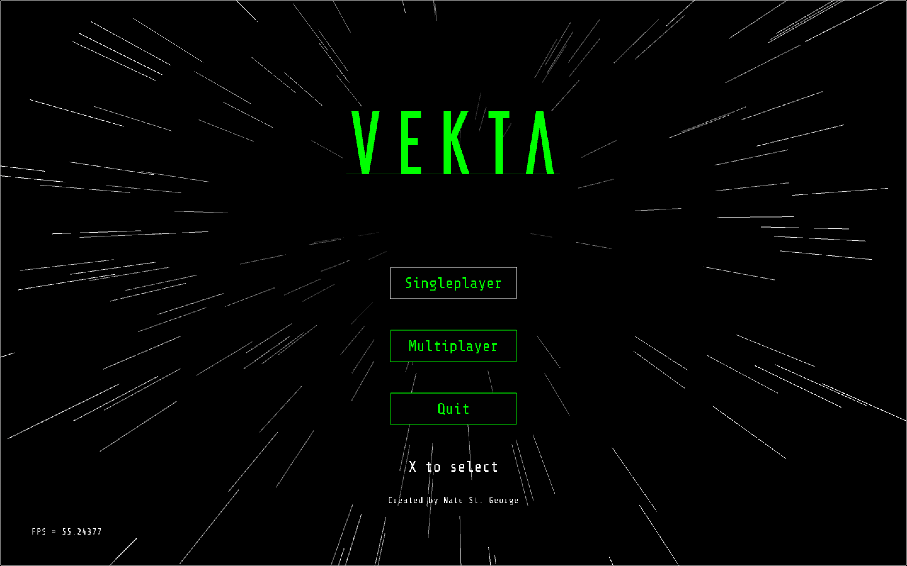
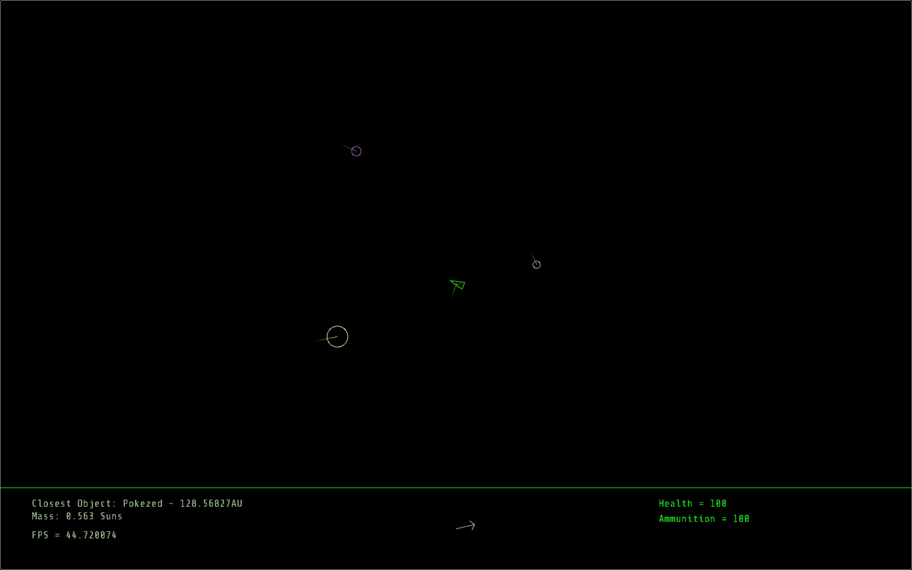

# VEKTA

## Downloads
Visit the [apps](https://github.com/StGerGer/vekta-processing/tree/master/apps) folder and find the executable you need. Not all of these versions are tested, so use at your own risk. For the latest version, it is best to download the source and compile it yourself.

## What is this?
VEKTA is a game created in Processing 3 to test the limits of Processing's capabilities in interactive games and real-time physics calculations.

All graphics (aside from the title in the main screen) are programmed as mathematical equations - the only saved image is the title.

Overall, this is nearly the most Processing seems to be capable of handling - there are many calculations performed every single frame. Maybe I'll get around to optimizing them... Or maybe not.

## What did I learn from this?
Don't write overly complex games in Processing. It's a bad time.

Processing is great for really simple projects. It's designed for artists and people who are unfamiliar with programming, which is a cool idea. Unfortunately, as a result of the compromises made for the sake of usability, Processing loses out on many of the organizational capabilities of its base language (Java).
This makes it really hard to write anything involving anything more than a few files, because all files must be in the same directory. That also makes it terrible to look at (as I'm sure you've noticed).

If I could get Processing to run bits of code on the GPU (specifically the ones that calculate all the influence vectors of each planet), that would cause an enormous boost in performance. I'm not really sure how to do that, though.

## Is it any good?
As simplistic as this game is, it's actually fun to catapult around the universe. The generated universes are fairly small, since I haven't written any sort of frustum culling functionality into the game - everything is rendered all the time, unless Processing handles that.

I wrote some music for the game that I'm proud of too, although as of v2019.1.15 the sound is broken so you can't hear it. 🤷‍♀️

If you want to make any changes, feel free to submit a pull request!

## License
This software is subject to the MIT License.

 ---
 
Copyright 2019 Nate St. George

Permission is hereby granted, free of charge, to any person obtaining a copy of this software and associated documentation files (the "Software"), to deal in the Software without restriction, including without limitation the rights to use, copy, modify, merge, publish, distribute, sublicense, and/or sell copies of the Software, and to permit persons to whom the Software is furnished to do so, subject to the following conditions:

The above copyright notice and this permission notice shall be included in all copies or substantial portions of the Software.

THE SOFTWARE IS PROVIDED "AS IS", WITHOUT WARRANTY OF ANY KIND, EXPRESS OR IMPLIED, INCLUDING BUT NOT LIMITED TO THE WARRANTIES OF MERCHANTABILITY, FITNESS FOR A PARTICULAR PURPOSE AND NONINFRINGEMENT. IN NO EVENT SHALL THE AUTHORS OR COPYRIGHT HOLDERS BE LIABLE FOR ANY CLAIM, DAMAGES OR OTHER LIABILITY, WHETHER IN AN ACTION OF CONTRACT, TORT OR OTHERWISE, ARISING FROM, OUT OF OR IN CONNECTION WITH THE SOFTWARE OR THE USE OR OTHER DEALINGS IN THE SOFTWARE.
